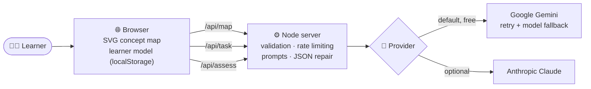

<div align="center">

# 🧩 Tessera

### Stop memorising. Start understanding.

**An AI learning companion that tests whether you can *explain*, *connect* and *apply* an idea, not whether you can recall it.**

[](https://tessera-ebh7.onrender.com/)


[**Try it**](https://tessera-ebh7.onrender.com/) · [How it works](#-how-it-works) · [Run locally](#-run-it-locally) · [Deploy](#-deploy)

</div>

> ⏳ The demo runs on a free plan, so the first visit after a quiet period can take up to a minute to wake up. It also uses a free AI quota, so if you hit a rate-limit message, wait a minute and retry.

---

## 💡 The problem

You can highlight a chapter, reread it three times, and still be unable to say **why** it works, how it connects to anything else, or what to do when the problem looks different. Rereading feels productive. Chatbots that hand over the answer feel even better. Neither tells you the one thing that matters: **what your mental model actually looks like.**

## ✨ The idea

> **A chatbot answers your questions. Tessera makes *you* answer, then diagnoses how you think.**

Give it any topic, or paste your own notes, and it builds a concept map. Then it asks you to *prove* you understand each concept in three different ways, grades your reasoning (not your wording), and names the exact misconception behind a wrong answer.

<div align="center">

```text
           ┌─────────────────────────────────────────────┐
           │   Each concept has THREE rings to close     │
           │                                             │
           │    🟠 Explain   🔵 Connect   🟢 Apply        │
           │    teach it     link it to    use it on a   │
           │    to a kid     other ideas   new problem   │
           └─────────────────────────────────────────────┘
```

</div>

| Ring | You do this | Why it works |
|---|---|---|
| 🟠 **Explain** | Teach the concept to **Pip**, a curious 12-year-old who keeps asking *"but why?"* | You can't hide behind jargon. Gaps in your reasoning surface immediately, and Pip's follow-up goes straight to them. |
| 🔵 **Connect** | Explain how two linked concepts affect each other, and what changes if one disappears | Knowledge sticks when it's a network, not a list. |
| 🟢 **Apply** | Solve a **freshly invented** real-world scenario that never names the concept | You can't pattern-match from a textbook example. This is real transfer. |

## 🆚 Why this isn't "just a wrapper"

| | A typical chatbot | 🧩 Tessera |
|---|---|---|
| **Who does the explaining?** | The AI | **You**, to a confused 12-year-old |
| **Feedback** | "Correct!" or a full answer | The **specific misconception** behind your answer |
| **Memory** | A chat log | A persistent **learner model** per concept, per skill |
| **Practice** | Textbook-style examples | **Novel scenarios** generated on the spot |
| **Structure** | A wall of text | An interactive **concept map** that fills in as you learn |
| **Next step** | You decide | The map **points to your weakest concept** |

## 🔬 The learning science behind it

Tessera is built on well-established ideas about how people learn, turned into software:

- **The Feynman technique / protégé effect:** teaching something exposes what you don't actually understand.
- **Retrieval practice:** producing an answer builds memory far better than rereading it.
- **Elaborative interrogation:** repeatedly asking *why* forces causal understanding.
- **Transfer of learning:** real understanding means using an idea in an unfamiliar context.
- **Misconception-based teaching:** fixing a specific wrong belief works better than repeating the right one.

## 🔍 What the AI returns

Every assessment is a **structured grade**, not a chat reply, which is what lets the app maintain a learner model. An illustrative example for the concept *"Price signals"* after a shallow answer:

```json
{
  "score": 46,
  "level": "Recalled",
  "solid": "You correctly said higher prices reduce how much people buy.",
  "gap": "You didn't explain why prices rise in the first place, or what that does to suppliers.",
  "misconception": "Believes prices are set by sellers' greed rather than emerging from scarcity.",
  "followUp": "Pip: But if a seller can just pick any price, why don't they pick a super high one every time?"
}
```

That `misconception` goes into your **ledger** and the concept gets a ⚠️ on the map until you answer it well. Scores are blended into mastery over time instead of being overwritten, and a strong answer (85+) earns a harder *"what if"* instead.

## 🏗 How it works



**Design decisions that matter**

- 🎯 **Hidden rubric.** Each concept stores its key mechanism and its most common misconception. They go to the model when grading but stay hidden from you unless you choose to peek.
- 🧱 **Structured output everywhere.** Every call is forced to JSON, so scores, levels, gaps and misconceptions drive the UI instead of being parsed out of prose.
- 🔁 **Dialogue-aware grading.** The assessor sees the whole conversation, so Pip's next question responds to what you actually said.
- 🛡 **Resilient by default.** Automatic retry on temporary overload (HTTP 503), fallback to other Gemini models if one is busy or out of quota, JSON repair, and proxy/IPv4 options for restrictive networks.
- 🔐 **Safe by design.** The API key lives on the server only, requests are size-limited and rate-limited per IP, static files are protected against path traversal, and all model output is HTML-escaped.
- 📦 **Zero dependencies.** No `npm install`, no build step, no framework. Just Node and under 600 lines of code you can read in one sitting.

## 🎬 Try this in 60 seconds

1. Open the [live demo](https://tessera-ebh7.onrender.com/) and build a map for **"Supply and demand"**.
2. Click a concept and give a **deliberately shallow, jargon-heavy** explanation. Watch Pip ask the question that exposes the gap.
3. Answer properly. Watch the ring fill and the misconception ledger update.
4. Switch to **🟢 Apply**, ask for a new scenario, and solve it.
5. Go back to the map. The halo points to the next concept to work on.

## 🚀 Run it locally

You need **Node.js 18+** and a free **Gemini API key** from [Google AI Studio](https://aistudio.google.com/apikey).

```bash
git clone https://github.com/SoumyadeepChattopadhyay2004/tessera-ai-tutor.git
cd tessera-ai-tutor
cp .env.example .env        # Windows: copy .env.example .env
# open .env and set GEMINI_API_KEY
npm start
```

Then open **http://localhost:3000**. There is nothing to install.

<details>
<summary><b>⚙️ Configuration reference</b></summary>

| Variable | Purpose | Default |
|---|---|---|
| `PROVIDER` | `gemini` or `anthropic` | `gemini` |
| `GEMINI_API_KEY` | Your Google AI Studio key | none |
| `GEMINI_MODEL` | Preferred Gemini model | `gemini-3.8-flash` |
| `GEMINI_FALLBACK_MODELS` | Comma-separated models tried if the first is overloaded or out of quota | `gemini-3.7-flash,gemini-3.5-flash` |
| `ANTHROPIC_API_KEY`, `MODEL` | Used when `PROVIDER=anthropic` | none |
| `ANTHROPIC_WORKSPACE_ID` | Only if your Anthropic key isn't scoped to a workspace | none |
| `PORT` | Server port | `3000` |
| `HTTPS_PROXY`, `FORCE_IPV4` | Network troubleshooting | none |

Free-tier model availability and limits change often, so check Google's current docs if a model is rejected.

</details>

<details>
<summary><b>🗂 Project structure</b></summary>

```text
tessera/
├── server.js        Zero-dependency Node server + provider layer
├── prompts.js       All the pedagogy: map design, scenario generation, grading rubric
├── package.json
├── .env.example     Config template (copy to .env, never commit .env)
└── public/
    ├── index.html
    ├── style.css
    └── app.js       Concept map, learner model, dialogue panel
```

</details>

## ☁️ Deploy

Tessera is a plain Node app, so any Node host works (Render, Railway, Fly.io).

1. Push the repo to GitHub (`.env` is already git-ignored).
2. Create a Web Service with build command `npm install` and start command `npm start`.
3. Set `PROVIDER` and `GEMINI_API_KEY` as environment variables on the host. Don't set `PORT`.

The live demo above runs on Render.

## ⚠️ Honest limitations

- Progress lives in your browser (`localStorage`), so it doesn't sync across devices.
- Grading quality depends on the underlying model; free models can be less consistent, and retrying usually helps.
- Everyone using a deployment shares the same free API quota.
- There are no accounts and no teacher view yet.

## 🗺 Roadmap

- [ ] Spaced-repetition scheduling that resurfaces weak rings at the right time
- [ ] Teacher dashboard that surfaces **class-wide misconceptions**
- [ ] Upload PDFs and slides as source material
- [ ] Voice-based teach-back for language learners and younger students
- [ ] Accounts and cross-device sync

**Built for the *AI + Education* challenge.**
Because the goal of learning isn't to remember an answer. It's to understand the question.

</div>
